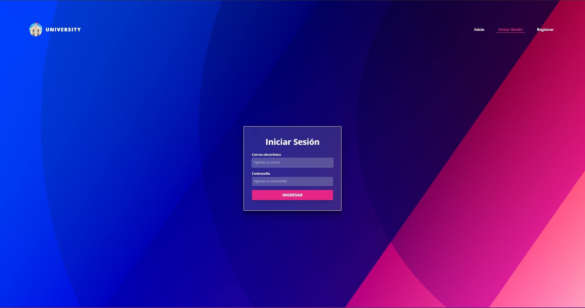
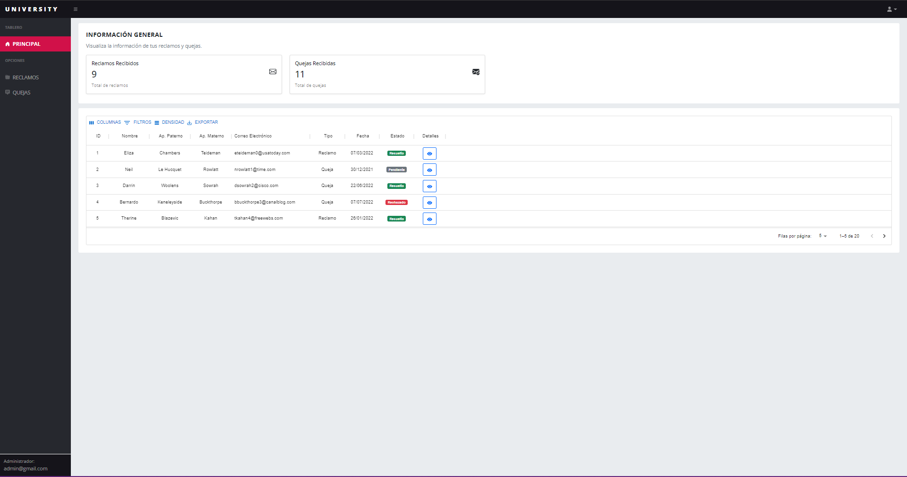
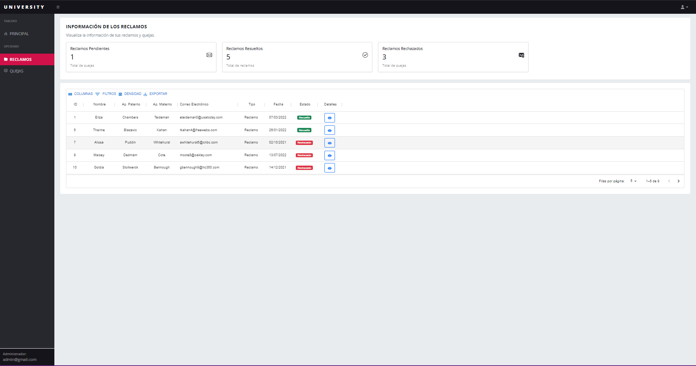
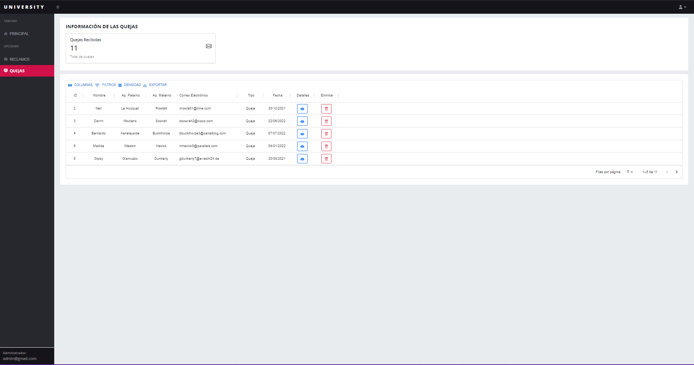
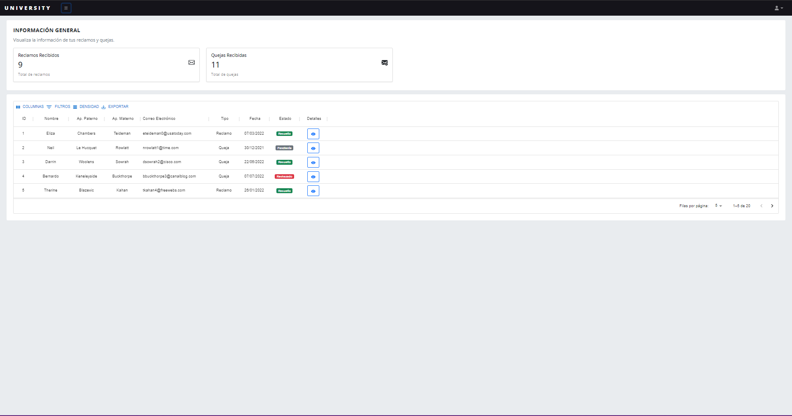
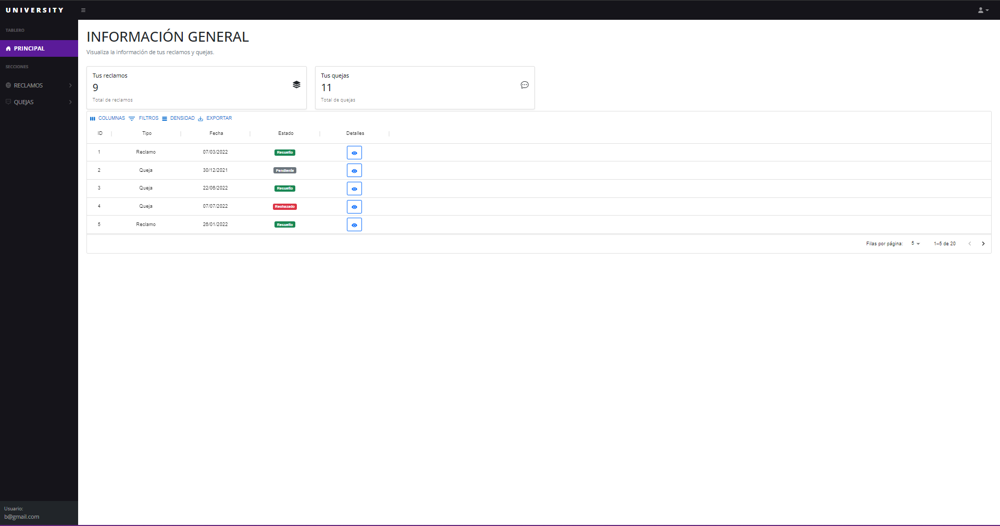
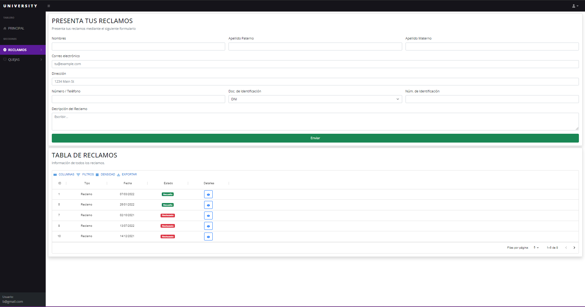
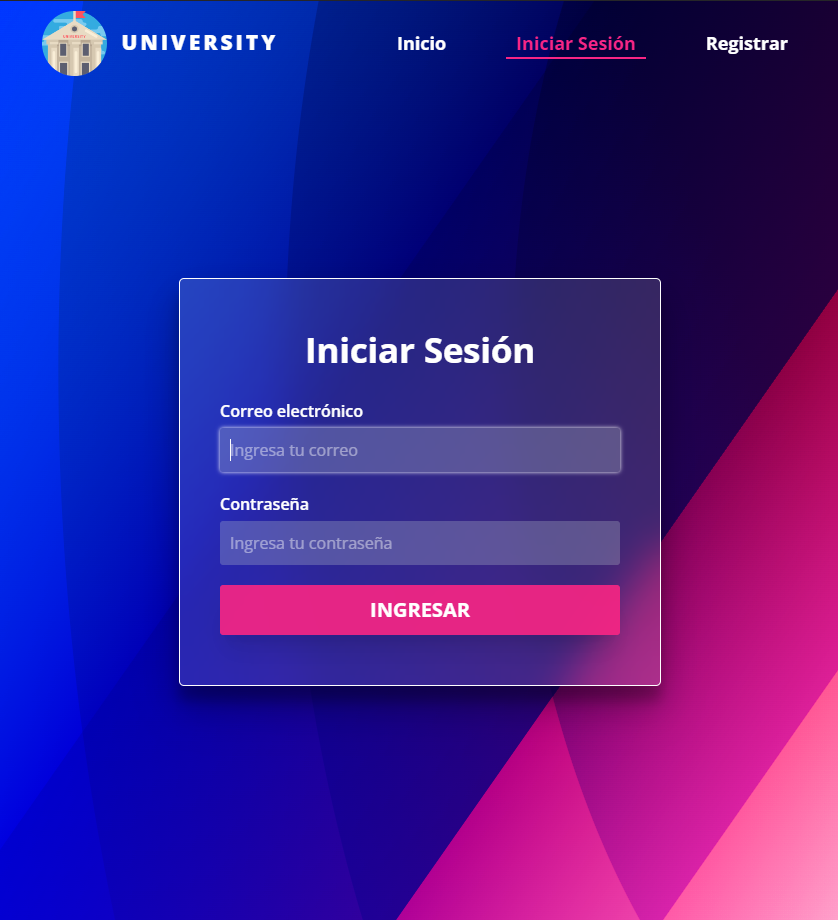
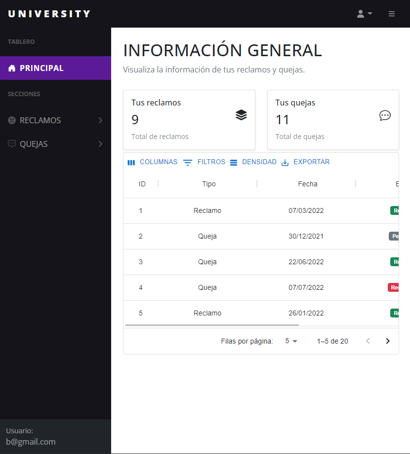
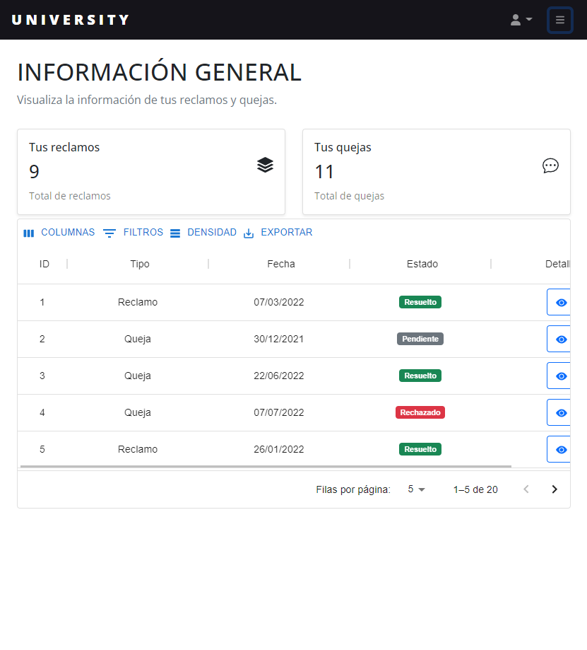

<div align="center">
  
</div>
<h1 align="center">
  RECLAMOS Y QUEJAS
</h1>
<p align="center"> 
This project is built with React using <a href="https://vitejs.dev/">Vite</a> 
</p>
<h1 align="center">
  Project Images 
</h1>
<h3>Main Image</h3>
<p align="center">
    
</p>
<h3>Login</h3>
<p align="center">
    
</p>
<h3>Admin Dashboard</h3>
<p align="center">
    
</p>
<p align="center">
    
</p>
<p align="center">
    
</p>
<p align="center">
    
</p>
<h3>Users Dashboard</h3>
<p align="center">
    
</p>
<p align="center">
    
</p>
<p align="center">
    
</p>
<h3>Responsive</h3>
<p align="center">
    
</p>
<p align="center">
    
</p>
<p align="center">
    
</p>


## How To Use

To clone and run this application, you'll need [Git](https://git-scm.com) and [Node.js](https://nodejs.org/en/download/) (which comes with [npm](http://npmjs.com)) installed on your computer. From your command line:

```bash
# Clone this repository
$ git clone https://github.com/pmspergge/Proyecto-Front-End.git

# Go into the repository
$ cd Proyecto-Front-End

# Install dependencies
$ npm install

# Run the app
$ npm run dev
```

> **Note**
> For the app to work properly, you also have to install the [backend](https://github.com/DonVoid18/backendTeam) with the following commands.

```bash
# Clone this repository
$ git clone https://github.com/DonVoid18/backendTeam.git

# Go into the repository
$ cd backendTeam

# Install dependencies
$ npm install

# Run the server
$ npm start
```

## Developers

&#128119; Patrick Rios (Perú)

&#128119; Matias Spergge (Argentina)
